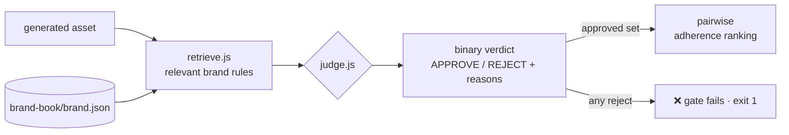

# ai-design-studio-sample — an AI asset-QA gate grounded in a brand book

**▶ Live demo: https://pvom.github.io/ai-design-studio-sample/**

> ⚠️ Sanitized portfolio sample. This mirrors the quality layer of an AI design studio I
> built (an app that generates on-brand visual assets). The brand book, assets and rules
> here are **100% synthetic**; no client identity, real brand, or production code is
> included. What's on show is the **QA gate** — how you keep an AI generator on-brand.

Generating design assets with AI is the easy half. The hard half is **governance**: how
do you stop the generator drifting off-palette, breaking contrast, or going off-voice —
automatically, at scale? This is that gate. It **retrieves the relevant brand rules** for
each asset and returns an **evidence-based APPROVE/REJECT**, plus a **pairwise ranking**
of the ones that pass. It's the same idea as [`agentic-qa-gate`](../agentic-qa-gate),
pointed at generated *assets* instead of a UI.

---

## Why it's different / the problem

A naive check hardcodes "allowed colors" in the validator. This instead treats the
**brand book as retrievable knowledge** and judges each asset only against the rules it
actually exercises — the same contract an **LLM-judge-over-RAG** uses in production:

1. **Retrieve** — pull the brand-book rules relevant to this asset (palette, contrast,
   spacing, radius, typography, tone). The judge reasons only over retrieved context.
2. **Binary verdict** — APPROVE/REJECT with a concrete violation per broken rule
   (`[R2] contrast 2.09 < 4.5`). No "looks off-brand" — always a reason.
3. **Pairwise** — among approved assets, score adherence (contrast headroom, palette
   fidelity) and rank them, so the studio ships the *best* on-brand option.

In this sample the judge is a deterministic rule engine so the harness is testable and
reproducible; an LLM judge slots in behind the **same interface** (retrieved rules in →
verdict + reasons out).

## Architecture



## What's in the repo

```
ai-design-studio-sample/
├── brand-book/brand.json   # synthetic brand: palette, spacing/radius scales, fonts, tone, rules R1–R6
├── assets/*.json           # 5 synthetic generated assets (2 compliant, 3 with planted violations)
├── src/
│   ├── retrieve.js         # RAG step — rules relevant to an asset
│   ├── judge.js            # binary verdict + pairwise adherence
│   ├── color.js            # hex + WCAG contrast
│   └── run.js              # CLI gate: judge all → rank approved → exit non-zero on any reject
└── test/judge.test.js      # 7 checks
```

## Run it

```bash
git clone <this-repo> && cd ai-design-studio-sample
node src/run.js     # judge all assets + pairwise ranking (exits 1 if any rejected)
npm test            # 7/7
```

No dependencies — plain Node.js (v18+).

## Results (reproducible)

- **2/5** synthetic assets approved, **3 rejected**, each with the exact rule + evidence
  (off-palette `#ff00ff`, contrast `2.09 < 4.5`, accent used as text, banned copy…).
- Pairwise ranks the two approved assets by adherence (contrast headroom + palette fidelity).
- The gate **exits non-zero** on any rejection, so it drops straight into CI.
- **7/7** tests green, zero dependencies.

## Stack

Node.js · pure JS (no deps) · WCAG contrast math · retrieval-grounded judging. Designed so
an LLM judge replaces the rule engine behind the same interface.

## Notes on sanitization

The brand book, rules and assets are invented ("Aurora"). No client brand, real design
system, generated production assets, or the studio's model/code are present. The
reproducible asset is the **QA gate pattern** — retrieve rules, judge with evidence, rank.
